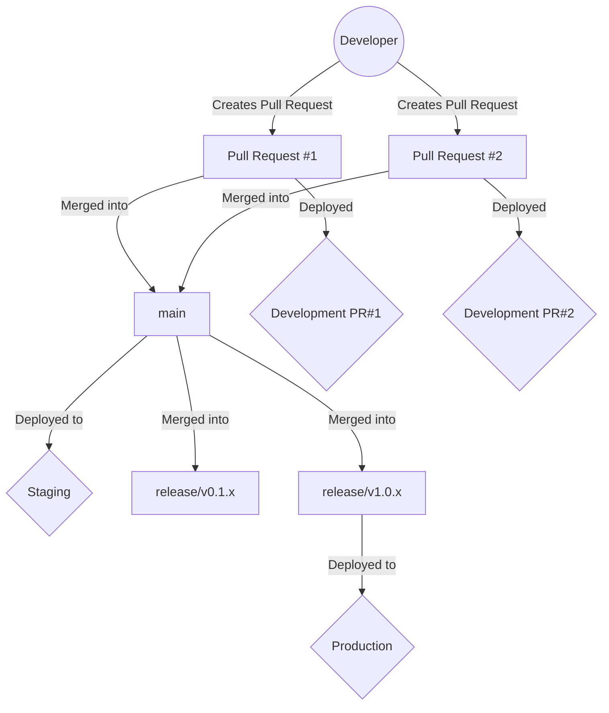

```mermaid
flowchart TD

  dev((Developer))

  pr-1[Pull Request #1]
  pr-2[Pull Request #2]

  main
  
  env-dev-1{Development PR#1}
  env-dev-2{Development PR#2}
  env-stg{Staging}
  env-prod{Production}

  rc01[release/v0.1.x]
  rc10[release/v1.0.x]
  

  dev-- Creates Pull Request -->pr-1
  dev-- Creates Pull Request -->pr-2
  pr-1-- Deployed -->env-dev-1
  pr-2-- Deployed -->env-dev-2
  pr-1-- Merged into -->main
  pr-2-- Merged into -->main
  main-- Deployed to -->env-stg
  main-- Merged into -->rc01
  main-- Merged into -->rc10
  rc10-- Deployed to -->env-prod


```